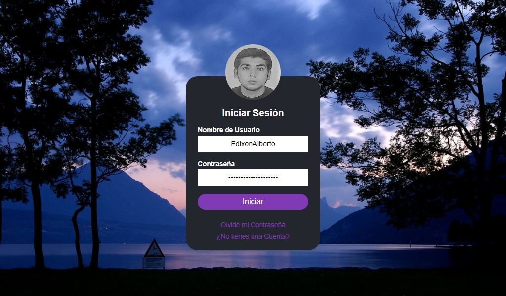

# Interface Login

[](https://www.linkedin.com/in/edixonalberto)
[](./LICENSE.md)
[](https://paypal.me/edixonp)


Login basico con **php**, utilizando:

- Motor de Plantillas `Laravel/Blade`
- Lenguaje de estilos `Stylus`


### Antes de editar esta plantilla

1. Instala `Laravel/Blade` escribiendo en tu terminal:

```
    $ composer install
```

2. Luego instala `Stylus` escribiendo:

```
    $ npm run install:styl
```

3. Y por ultimo, inicia el compilador CSS de `Stylus` colocando:

```
    $ npm run build:styl
```

### Pre-view

